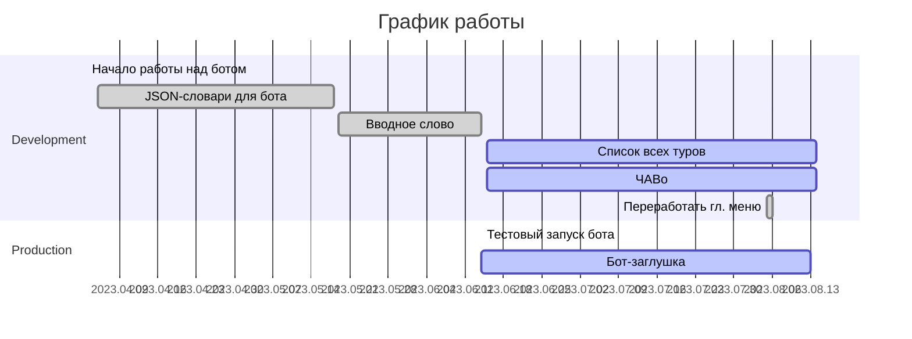
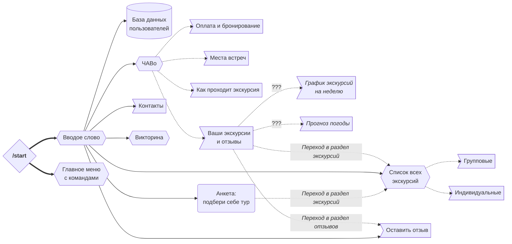

# Бот-помощник в Telegram для компании «Пешеход Тур»

©2023 [Пешеход Тур](https://peshehodtour.ru)

Разработчик: Валерий Тропин, [tropin.one](https://tropin.one)

## Стек

Бот написан на *Python* с использованием фреймворка *aiogram*.

*Python* 3.11  
*aiogram* v3 (beta)

Документация (docstrings) для классов, функций и методов написана при неоценимой поддержке *GPT 3.5*.

Токен бота хранится в файле `.env`.

В корне репозитория есть файл [`.env.example`](.env.example). Переименуйте его в `.env`
и вставьте внутрь токен от своего бота, полученный от [`@botfather`](https://t.me/botfather).

## План по запуску разделов бота

- [x] Вводное слово 2023.06.14
- [ ] Список всех туров (код написан к 2023.08.04)
- [ ] ЧАВо (код написан к 2023.08.04)
- [ ] База данных пользователей (для статистики и последующего слияния с ORM)
- [ ] Контакты
- [ ] Оставить отзыв
- [ ] Анкета (подбери себе тур)
- [ ] Викторина

## Рабочая схема разделов бота

