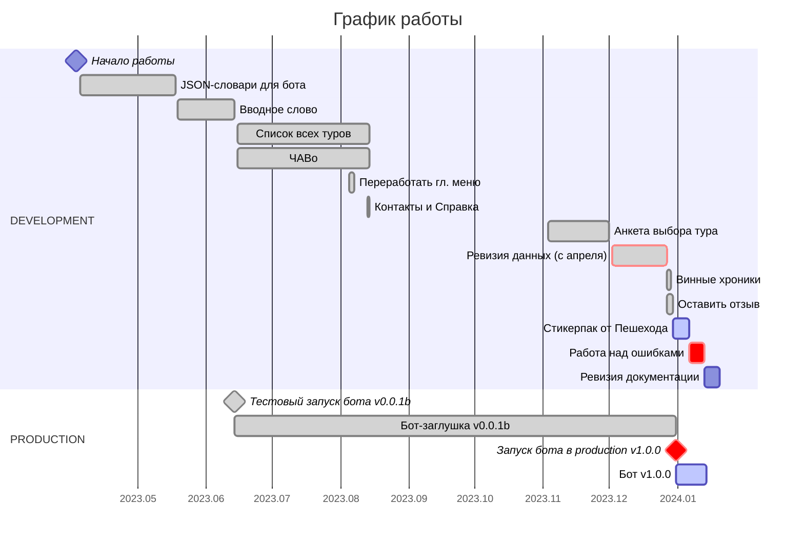
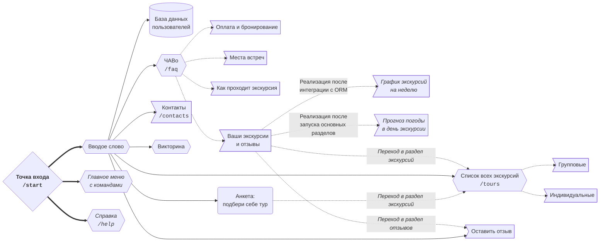

# Бот-помощник в Telegram для компании «Пешеход Тур»

Бот написан по заказу компании [«Пешеход Тур»](https://peshehodtour.ru) в 2023 году.

Разработчик Валерий Тропин — [tropin.one](https://tropin.one).

<!-- vim-markdown-toc GFM -->

* [Стек](#Стек)
* [Готовность разделов](#Готовность-разделов)
* [График работы](#График-работы)
* [Перспективная схема разделов бота](#Перспективная-схема-разделов-бота)

<!-- vim-markdown-toc -->

## Стек

Бот написан на **Python 3.12** с использованием фреймворка **aiogram 3.3.0**. Под **Python 3.10+** тоже работает.

Данные для FSM хранятся и обрабатываются с помощью **Redis** и **SQLite**.

> Необходимо отдельно установить Redis и SQLite в систему, запустить сервер Redis в фоновом режиме, чтобы бот заработал.

<i>Подробнее про установку Redis и SQLite на Ubuntu и другие ОС</i>

Установка [Redis](https://timeweb.cloud/tutorials/redis/ustanovka-i-nastrojka-redis-dlya-raznyh-os)
 
`sudo apt install redis`
 
`sudo service redis-server restart`
 
`redis-cli ping` → если вернул `PONG`, то сервер запущен.

Установка [SQLite](https://timeweb.cloud/tutorials/sqlite/rukovodstvo-po-nastrojke-sqlite)
 
`sudo apt install sqlite3`
 
`sqlite3 --version`

Зависимости указаны в файле [`requirements.txt`](requirements.txt).

Документация для модулей, классов, функций и методов, аннотации типов написаны при неоценимой поддержке [GPT-3.5](https://chat.openai.com) и [Phind Model](https://www.phind.com).

Токен бота хранится в файле `.env`. В корне репозитория есть файл [`.env.example`](.env.example). Переименуйте его в `.env`
и вставьте внутрь токен от своего бота, полученный от [`@BotFather`](https://t.me/botfather).

> Либо используйте секреты Docker для добавления токена бота и прочей чувствительной информации в контейнер на проде — библиотека `environs`, которая используется в проекте, в теории, сможет извлечь переменные окружения оттуда тоже.

## Готовность разделов

- [x] 2023.06.14 Вводное слово
- [x] 2023.08.04 Список всех туров
- [x] 2023.08.04 ЧАВо
- [x] 2023.08.13 Контакты
- [x] 2023.12.01 Анкета выбора тура
- [x] 2023.12.27 Раздел с лекциями «Винные хроники»
- [x] 2023.12.29 Бонус от Пешехода
- [x] 2023.12.30 Оставить отзыв
- [ ] Стикерпак от Пешехода

## График работы

## Перспективная схема разделов бота

