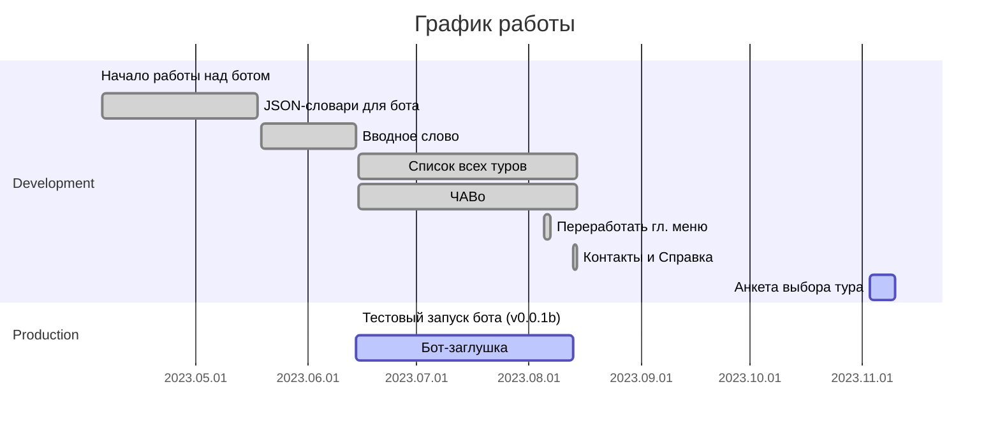

# Бот-помощник в Telegram для компании «Пешеход Тур»

Бот написан по заказу компании [«Пешеход Тур»](https://peshehodtour.ru) в 2023 году.

Разработчик Валерий Тропин — [tropin.one](https://tropin.one).

<!-- vim-markdown-toc GFM -->

* [Стек](#Стек)
* [План по запуску разделов бота](#План-по-запуску-разделов-бота)
* [Рабочая схема разделов бота](#Рабочая-схема-разделов-бота)

<!-- vim-markdown-toc -->

## Стек

Бот написан на **Python 3.11** с использованием фреймворка **aiogram 3.2.0**.

Информация о пользователях и данные для FSM хранятся и обрабатываются с помощью **Redis**.

Зависимости указаны в файле [`requirements.txt`](requirements.txt).

Документация (docstrings) для классов, функций и методов написана при неоценимой поддержке [GPT-3.5](https://chat.openai.com).

Токен бота хранится в файле `.env`. В корне репозитория есть файл [`.env.example`](.env.example). Переименуйте его в `.env`
и вставьте внутрь токен от своего бота, полученный от [`@BotFather`](https://t.me/botfather).

## План по запуску разделов бота

- [x] Вводное слово 2023.06.14
- [x] Список всех туров (код написан к 2023.08.04)
- [x] ЧАВо (код написан к 2023.08.04)
- [ ] База данных пользователей (для статистики и последующего слияния с ORM)
- [x] Контакты 2023.08.13
- [ ] Оставить отзыв
- [ ] Анкета выбора тура (в процессе)
- [ ] Викторина

## Рабочая схема разделов бота

